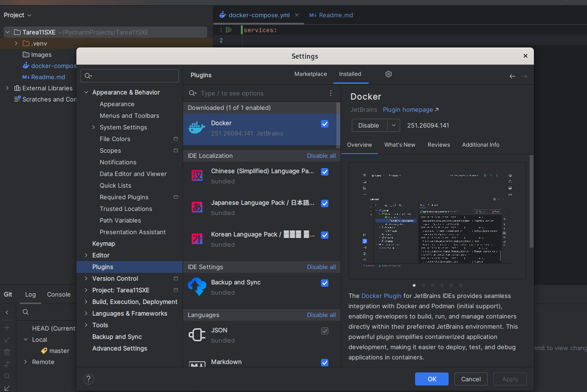
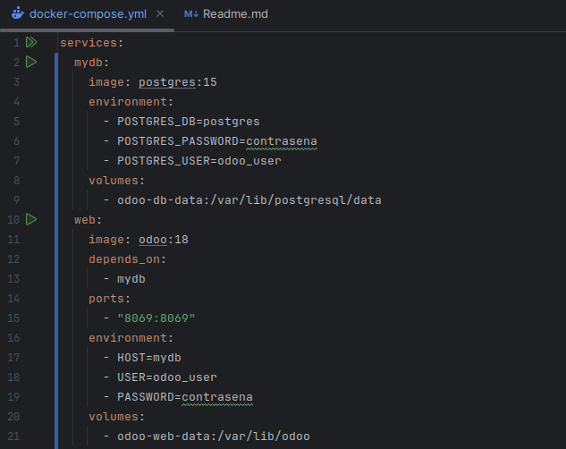
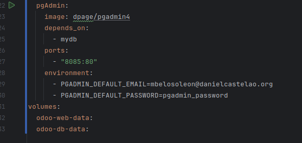
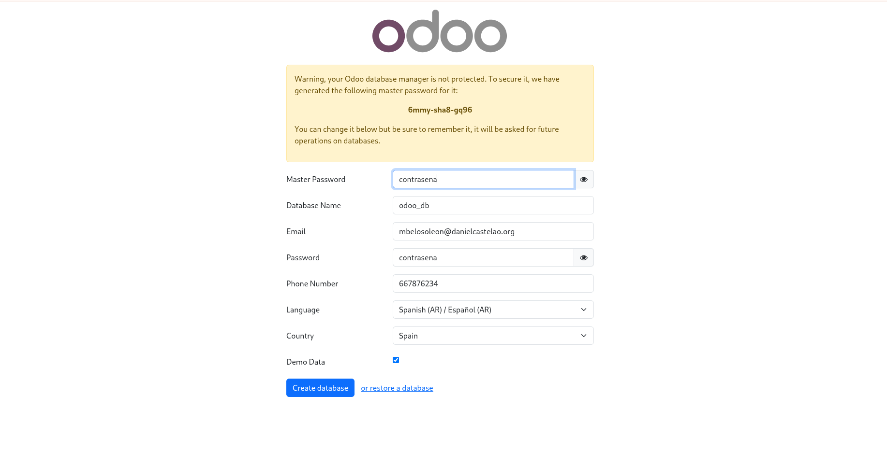
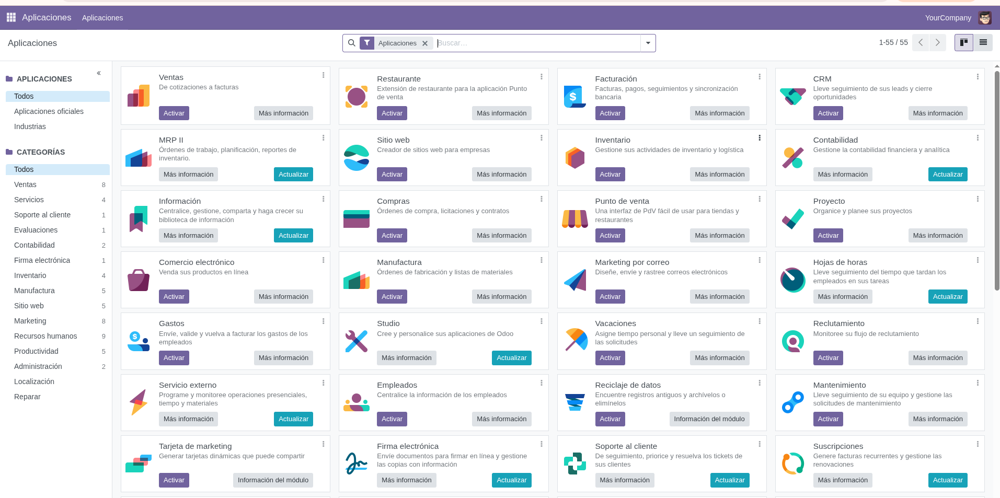

Paso 1:
Para configurar el IDE a utilizar (PyCharm), para poder usar Docker,
debemos instalar el plugin de Docker.

En la opción settings, en plugins, podemos ver los plugins instalados.

Escribimos el fichero docker-compose.yml con los servicios de odoo, la base de datos y pgadmin

Primero creamos la base de datos de oodo rellenando los datos

                                      

Con la base de datos creada, iniciamos sesion

Este es el menú principal

